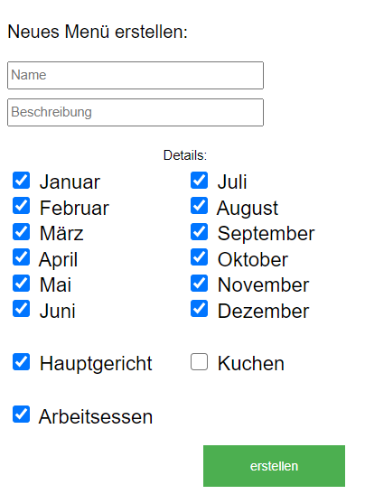
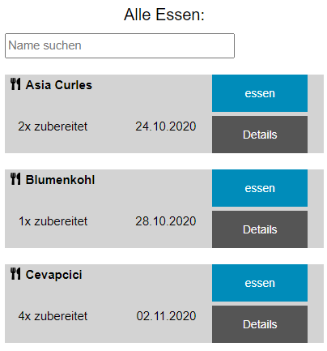

# mealTracker 

What is this?

- This is a React App with Express Backend used to track all of your meals. Add meals and data about them, if you eat a meal klick "eat" and the app will recommend you meals you have not eaten in a long time. 

- You are able to distinguish between Main-Meals and Snacks. You are also able to add months where you want to eat the meal or if the meal is feasable to eat 
when working or to take it with yourself to your workplace.

| |
|:--:|
| *Home |

- Once you have added a menu you will be able to insert the fact, that you have eaten it today. Afterwards you are able to see how often you have eaten each menu but you also get recommendations based on months and menus you havent eaten in a long time.

| |
|:--:|
| *Home |

- Their is also an recommendation for those workmeals so you are able to find one for the next day quickly.

Note: The Design of this Project is only optimised for mobile-phones, it works on Desktop as well but can look a bit strange at times. The filters are based on my own personal use-case.

## first Time: 

Basic Requirement: Install node.js and an mysql db, if you need help use Google Tutorials

1. Create your own config.js - Use the given Template 

2. Create Database "mealtracker"

3. Run the SQL-Commands inside of the migrations-File on your "mealtracker" Database

4. Run "npm install" to install all dependencies 

## to run:

1. "run npm run build" to put all JS-Files together 
-> Not needed, if there are no changes inside of the FE Files and you only changed the Backend of the Service

2. "node server.js" to run FE and BE on localhost:8080
